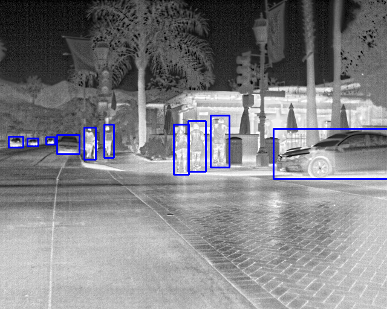

# Data Augmentation strategies for Object Detection in thermal spectral images

 
This repository is forked from great work pytorch-yolov3 of <a href="https://github.com/andy-yun/pytorch-0.4-yolov3">@github/andy-yun </a> 
. However, this repository is changed many files and functions for our research.

### How to run this repository
1. Download or clone this repository to your computer.
2. Install some basic requirements if needed.
3. Download <a href="https://drive.google.com/file/d/1Kyoyira0liRRr_FOY8DDSeATLQAwXtu-/view?usp=sharing">kaist_thermal_detector.weights</a> or <a href="https://drive.google.com/file/d/1xx4nhja95VeFsZydTycD8ArTYl1p-bnx/view?usp=sharing">flir_detector.weights </a> files and put in the directory 'weights'.
4. Open a terminal and run following commands according to functions:

Noted that all of these instructions for Linux environment (for Windows, you should visit original repository to read more)

### Some default parameters:
* weightfile = weights/flir_thermal_detector.weights 
* configurationfile = cfg/yolov3_flir.cfg 
* datafile = data/flir.data
* listname = data/flir.names
For all of following commands, if command with [...] will be an option,
you can use your parameter or leave there to use default paramaters above.

### Train the model:
Train the model without augmentation
```
python train.py
```

### Train the model with Rand augmentation:
Train the model without augmentation
```
python train_randaug.py
```

### Detection (detect bounding box):
Detect bounding box result on image(s) or video by parameter: 
image file or folder with all images or video file. 
The result will appear with the same name + 'predicted'
```
python detect.py image/video/folder
Example:
python detect.py thermal_kaist.png
```


```
python map.py weightfile
```

### Evaluation PR (precision, recall, corrects, fscore):
```
python eval.py [weightfile]
```

### Draw bounding box:
Given the folder of images with its annotation.
Drawing bounding box on every image with correct detection (blue boxes),
wrong detection (red boxes) and miss detection (green boxes)

```
python drawBBxs.py imagefolder
```

### Demo on webcam:

```
python demo.py
```


### Example results:


[]

### Initial Results:

FLIR dataset results (precision):
* person:    	75.6%
* bicycle:   	57.4%
* car:         	86.5%

mean Average Precision:  	73.2%

### Mean Average Precision with data augmentation strategies :

* Boundary Box Augmentation	74.4%
* RandAugment	73.7%
* BBOX and RandAugment	73.8%


## Citation
We really hope this repository is useful for you. Please cite the paper as
```
@inproceedings{kieu2019domain,
	Author = {Kieu, My and Bagdanov, Andrew D and Bertini, Marco and Del Bimbo, Alberto},
	Booktitle = {Proc. of International Conference on Image Analysis and Processing (ICIAP)},
	Title = {Domain Adaptation for Privacy-Preserving Pedestrian Detection in Thermal Imagery},
	Year = {2019}
	}
```

If you use our Layer-wise method, please cite our paper as
```
@inproceedings{kieu2020layerwise,
	Author = {Kieu, My and Bagdanov, Andrew D and Bertini, Marco},
	Booktitle = {ACM Transactions on Multimedia Computing Communications and Applications (ACM TOMM)},
	Title = {Bottom-up and Layer-wise Domain Adaptation for Pedestrian Detection in Thermal Images},
	Year = {2020}
	}
```

If you have any comment or question to contribute, please leave it in Issues.

Other question, please contact me by email: my.kieu@unifi.it.

Thank you.
